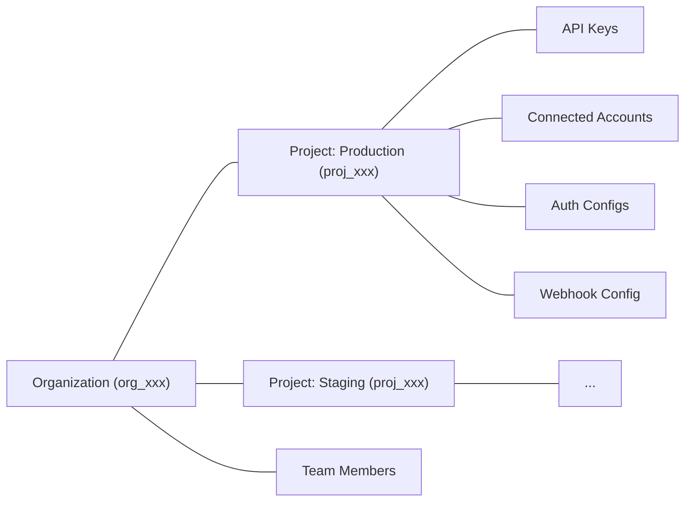

Projects are Composio's multi-tenancy primitive. Every Composio account belongs to an **organization**. Inside an organization, **projects** are isolated environments that scope your API keys, connected accounts, auth configs, and webhook configurations. Resources in one project are not accessible from another.



Common reasons to use multiple projects:

- **Separate environments**: keep production and staging isolated
- **Separate products**: keep resources for different apps independent
- **Client isolation**: give each client their own project with separate credentials and data

## Managing projects

Manage projects from the [dashboard](https://dashboard.composio.dev/~/org/) or via the API using an **organization API key** (`x-org-api-key`).

<Callout type="info">
Project management endpoints use the `x-org-api-key` header, not the regular `x-api-key`. Find your org API key in the dashboard under **Settings > Organization**.
</Callout>

There is no limit on the number of projects per organization. Project names must be unique within the organization. Create a project with `should_create_api_key: true` to get an API key back in the response:

```bash
curl -X POST https://backend.composio.dev/api/v3.1/org/owner/project/new \
  -H "x-org-api-key: YOUR_ORG_API_KEY" \
  -H "Content-Type: application/json" \
  -d '{
    "name": "my-staging-project",
    "should_create_api_key": true
  }'
```

```json
{
  "id": "proj_abc123xyz456",
  "name": "my-staging-project",
  "api_key": "ak_abc123xyz456"
}
```

The list endpoint supports pagination with `limit` and `cursor`; getting a project by ID returns the full project object including its API keys.

## Project settings

Each project has settings that control security, logging, and display behavior. The project detail endpoints return current configuration for inspection. Use **Settings > Project Settings** in the [dashboard](https://dashboard.composio.dev/~/project/settings/general) to update project settings.

Notable security setting: `require_mcp_api_key`, when `true`, requires MCP server requests to include a valid `x-api-key` header. This defaults to `true` for organizations created on or after March 5, 2026.
